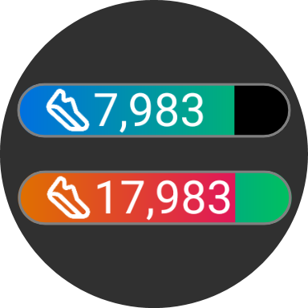

# Watch Face Format Sample Complication Slot

This is a minimalistic [Watch Face Format (WFF)](https://developer.android.com/training/wearables/wff/watch-face) complication slot to demonstrate the use of [XML Preprocessor](https://github.com/gondwanasoft/xml-preprocessor).

    

## Purpose

This complication slot is unlikely to meet requirements for a real watch face. You will need to modify it, or create your own package based on it, to display complications as you want. You will then be able to reuse the package in other watch faces with little need to consider its internal details.

## Description

The slot only supports the `GOAL_PROGRESS` complication type.

One progress bar is displayed as progress moves from 0 to `goal`. A second progress bar is overlaid as progress moves from `goal` to `goal*2`. No attempt is made to display progress beyond `goal*2`.

`Text` and `Icon` are displayed, if available. `Title` is not displayed.

Icon and font sizes are scaled based on slot height. Slot width isn't taken into account.

In AOD mode (_ie_, ambient variant), progress bars are hidden but text remains visible. An ambient (burn-protect) icon is used if available; otherwise no icon is displayed.

> [!Note]
> What AOD adjustments are actually necessary depends on the rest of the watchface. You'll probably need to adjust the complication's AOD behaviour to suit its context.

## Installation

The best way to install [XML Preprocessor](https://github.com/gondwanasoft/xml-preprocessor) and this package is by using [Clockwork](https://clockwork-pkg.pages.dev/).

If you don't want to use Clockwork, you can manually install [XML Preprocessor](https://github.com/gondwanasoft/xml-preprocessor) and copy `sample-complic.xml` from this repository to a directory within your watch face project.

## Usage

If you installed this package using Clockwork, you can import it into your watchface project by putting this in `watchface-pp.xml`:

    <Import href="../packages/wff-sample-complic-pkg/sample-complic.xml" />

> [!NOTE]
> If you installed `sample-complic` manually, you'll probably need to adjust `href`.

To insert a `sample-complic` into your watch face, put something like this where a `<ComplicationSlot>` is allowed:

    <Use href="sample-complic" slotId="1" x="175" y="100" width="100" height="25" />

Build your watch face project using [Clockwork](https://clockwork-pkg.pages.dev/) or [XML Preprocessor](https://github.com/gondwanasoft/xml-preprocessor) with gradle.

> [!Note]
If you don't see any complications from which to choose when you use your watch face, that may be because you don't have any apps that can provide the `GOAL_PROGRESS` complication type. For testing purposes, you can use [Google's Android Complications Sample](https://github.com/android/wear-os-samples/tree/main/Complications).

### Customisation

To customise the colours, include `data-` attributes in the `<Use>`; _eg_:

    <Use href="sample-complic"
        slotId="3"
        x="125"
        y="330"
        width="200"
        height="50"
        data-colour-info="#000000"
        data-colour-low-start="#608060"
        data-colour-low-end="#00ff00"
        data-colour-high-start="#c0c000"
        data-colour-high-end="#ff4040"
        data-colour-border="#c0c0c0"
        data-colour-background="#808080" />

> [!Note]
> [WFF ColorConfiguration](https://developer.android.com/reference/wear-os/wff/user-configuration/color-configuration) values can't be used to adjust progress bar colours because [WFF doesn't allow them in gradients](https://issuetracker.google.com/issues/376498172).

To customise the border thickness, assign a value to `BORDER_THICKNESS` in a `<Define>` element before the `<Use...>`; _eg_:

    <Define>BORDER_THICKNESS=2</Define>
    <Use href="sample-complic" ...

> [!Note]
> A different approach is used to demonstrate customising border thickness just to show how it can be done.

You can make more radical changes to the complication (without changing the source file) using XML Preprocessor's [`<Transform>`](https://github.com/gondwanasoft/xml-preprocessor?tab=readme-ov-file#transform) and [`<Delete>`](https://github.com/gondwanasoft/xml-preprocessor?tab=readme-ov-file#delete) facilities.